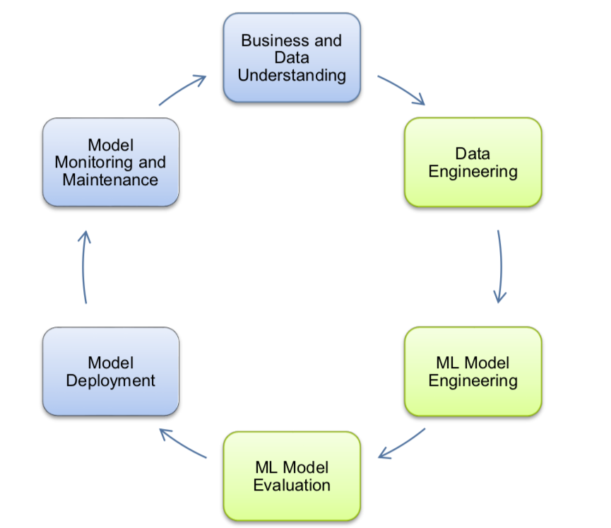

# PaperScissorsRock_byHandmodels
This project contains the source code and scientific work for the master project Explainable Machine Learning (xAI-Proj-M) at the University of Bamberg. 

The goal of the project is to develop a machine learning application considering the three steps Data Engineering, ML Model Engineering and ML Model Evaluation, which are part of the Deep Learning Life Cycle.
A separate research question is processed for each step but our overall goal is to develop ... 

  
   

## How to set up 
Firstly you have to clone the repository on your local device. Afterwards you can create the predefined environment by using "conda enc create -f environment.yml".

Now the set up is ready to use and you can run the file "main.py". 

## Data Engineering

## ML-Model Engineering

## Model Evaluation
