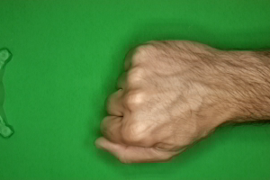
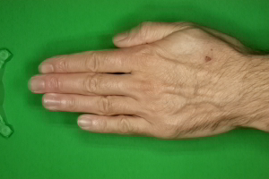
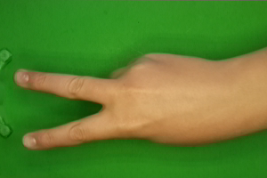

# PaperScissorsRock_byHandmodels
This project contains the source code and scientific work for the master project "Explainable Machine Learning (xAI-Proj-M)" at the University of Bamberg. 

The goal of the project is to develop a machine learning application considering the three steps data engineering, ML model engineering and ML model evaluation, which are part of the deep learning life cycle.
A separate research question is processed for each step but our overall goal is to detect the hand signs based on images.

<p align="center">
  
</p>

## Set up 
Clone the repository on your local device.

### Local Execution

#### Virtual Environment

##### Prerequisites local

- You have [Python](https://www.python.org/) installed on your machine
- You have [Anaconda](https://www.anaconda.com/) or at least [Miniconda](https://docs.conda.io/en/latest/miniconda.html) installed on your machine

##### Install your environment

Open a PowerShell/Terminal window, navigate to your project folder and setup your environment via `conda env create -f environment.yml`. To update your existing environment use `conda env update`

##### Execute your code local

Enter following command in your terminal while you are in your project root directory

```terminal
python src/main.py
```

The default setting of main.py is to load and evaluate the best model (a transfer learning model) which is based on the efficientNet_B0 model provided by pyTorch.
It also outputs predictions for random images from the validation dataset.

You can change this setting in the main.py file.

These following options are available:
  1. Train new transfer learning model:
    a) Set the boole variable "train_new_transferlearning_model" = True 
    b) Set the hyperparameter values you want to use
    c) Save the changes
    d) Run the main.py file again
  2. Evaluate an existing model:
    a) Change the path for the variable "model_folder" to your model you want to evaluate
    b) Set the boole variable "evaluate_existing_model" = True
    c) Set the number of images you want to evaluate in variable "num_images_val"
    d) Save the changes
    e) Run the main.py file again
  3. Make prediction on a single image:
    a) Change the path for the variable "single_image_path" to your image you want to classify
    b) Set the boole variable "prediction_on_single_image" = True
    c) Save the changes
    d) Run the main.py file again


## Dataset
For our project we combined the following three subdataset with in total 7477 images:
- [Roboflow Dataset](https://public.roboflow.com/classification/rock-paper-scissors) with 2925 images
  <p float="right">
    
     
     
  </p>

- [Kaggle Dataset](https://www.kaggle.com/datasets/drgfreeman/rockpaperscissors) with 2188 images
  <p float="right">
    
     
     
  </p>

- [Kaggle Dataset](https://www.kaggle.com/datasets/glushko/rock-paper-scissors-dataset) with 2364 images
  <p float="right">
    
     
     
  </p>

## Data Engineering
In this part we want to consider the research question "Which data augmentation methods can increase the model's performance in classifying images of „Rock, Paper, Scissors“ hand signs?"
## ML-Model Engineering
In this part we want to consider the research question "Can transfer learning bring a benefit on the performance of CNN models for Rock, Paper, Scissors?". 

## Model Evaluation
