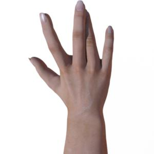
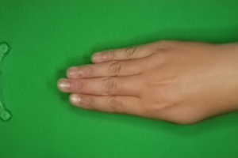
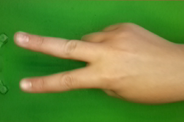
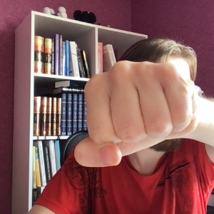
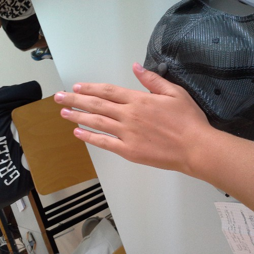
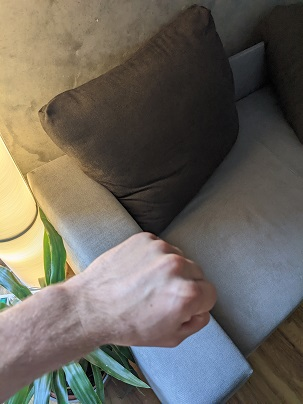
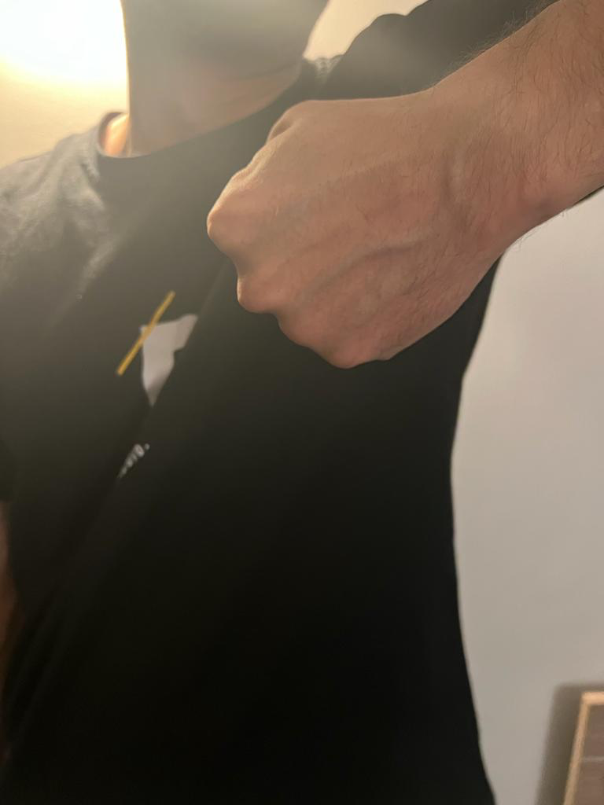
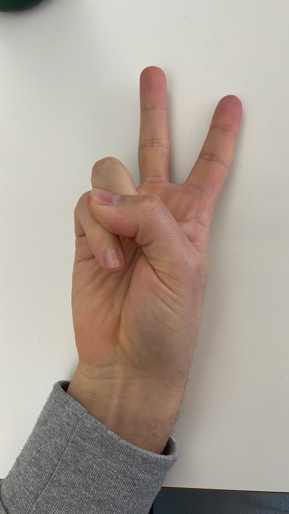

# PaperScissorsRock_byHandmodels
This project contains the source code and scientific work for the master project "Explainable Machine Learning (xAI-Proj-M)" at the University of Bamberg. 

The goal of the project is to develop a machine learning application considering the three steps data engineering, model engineering and model evaluation, which are part of the deep learning life cycle.
A separate research question is processed for each step but our overall goal is to detect the hand signs paper, scissors, and rock based on images.

<p align="center">
  
</p>

## Set up 
Clone the repository on your local device.

### Local Execution

#### Virtual Environment

##### Prerequisites local

- You have [Python](https://www.python.org/) installed on your machine
- You have [Anaconda](https://www.anaconda.com/) or at least [Miniconda](https://docs.conda.io/en/latest/miniconda.html) installed on your machine

##### Install your environment

Open a PowerShell/Terminal window, navigate to the git project folder and setup your environment via 
```terminal
conda env create -f environment.yml
```
To update the existing environment use
```terminal
conda env update
```

##### Execute the code 

Enter the following command in your terminal while you are in your project root directory

```terminal
python src/main.py
```

The default setting of main.py evaluates our best trainend model on the test set. It displays the confusion matrix and prints out the achievied top-1 accuracy. The model is trained using the EfficientNetV2-S architecture provided by PyTorch which is pretrainend on the ImageNet-1K dataset.

You can change this setting in the main.py file.

These following options are available:
  1. Train a new transfer learning model: </br>
    a) Set the boole variable "train_new_transferlearning_model" = True </br>
    b) Set the hyperparameter values you want to use for the grid search hyperparameter tuning in the config file </br>
    c) If you want to use also data augmention for training the model set activate_Augmentation=True and the combination you want to use
    d) Set all other boolean variables to False </br>
    e) Run the main.py file again </br>
  2. Train a new baseline model: </br>
    a) Set the boole variable "train_new_baseline_model" = True </br>
    b) Set the hyperparameter values you want to use for the grid search hyperparameter tuning in the config file </br>
    c) If you want to use also data augmention for training the model set activate_Augmentation=True and the combination you want to use
    d) Set all other boolean variables to False </br>
    e) Run the main.py file again </br>    
  3. Test an existing model: </br>
    a) Change the path of the variable "model_folder" to the model you want to evaluate </br>
    b) Change the path of the variable "test_folder" to your image path you want to test on </br>
    c) Set the boole variable "test_existing_model" = True and all other boole values = False </br>
    d) Run the main.py file again </br>
  4. Display some example images with the prediction of the model: </br>
    a) Change the path for the variable "test_folder" to your image folder you want to make predicitons on </br>
    b) Set the boole variable "prediction_on_images" = True, all other boole variables = False </br>
    c) Run the main.py file again </br>
  5. Display a single image and the prediction of the model: </br>
    a) Change the path for the variable "single_image_path" to your image you want to classify </br>
    b) Set the boole variable "prediction_on_single_image" = True, all other boole variables = False </br>
    c) Run the main.py file again </br>
  6. Display model metrices: </br>
    a) Change the path of the variable "model_folder" to the model you want to evaluate </br>
    b) Set the boole variable "model_metrices" = True, all other boole variables = False </br>
    c) Run the main.py file again </br>
  7. Use LIME to see the areas which the model used to make the prediction: </br>
    a) Change the path of the variable "model_folder" to the model you want to evaluate </br>
    b) Change the path for the variable "single_image_path" to your image you want to evaluate   
    c) Set the boole variable "LIME_single_Image" = True, all other boole variables = False 

## Dataset
For our project we combined the following five subdatasets:
- [Roboflow Dataset](https://public.roboflow.com/classification/rock-paper-scissors) with 2925 images
  <p float="right">
    
     
     
  </p>

- [Kaggle Dataset](https://www.kaggle.com/datasets/drgfreeman/rockpaperscissors) with 2188 images
  <p float="right">
    
     
     
  </p>

- [Kaggle Dataset](https://www.kaggle.com/datasets/glushko/rock-paper-scissors-dataset) with 2351 images
  <p float="right">
    
     
    
  </p>
  
- [giusti2018](https://github.com/alessandro-giusti/rock-paper-scissors) with 2419 images
  <p float="right">
    
     
     
  </p>
  
- Own validation set created with all class members with 151 images
  <p float="right">
    
     
    
  </p>
  
 - Own test set created with all class members with 158 images
  <p float="right">
    
     
     
  </p> 
 
In total our combined dataset consists of 10192 images which you can find splitted into train, test, and validation sets. The Datasets 1 to 4 are used for training and validation. We used 80% for training and 20% for validation. In addition, the validation set was extenden with dataset 5. Dataset 6 is used as test set.

# Project Structure
The combined dataset is stored in the data_combined folder.The original datasets are stored in the data_orignal folder. The models folder contains the best trained model of the Baseline Model, the Transfer Learning Model, and the Transfer Learning model with Data Augmentation. You can also find there the csv-files with all training information of the models. In the src folder you can find the main.py and all necassary files.

# Research Questions 
The results of these research questions can be found in the final report.
## Data Engineering
In this part we want to consider the research question "Which data augmentation methods can increase the model's performance in classifying images of „Rock, Paper, Scissors“ hand signs?"

## ML-Model Engineering
In this part we want to consider the research question "Can transfer learning bring a benefit on the performance of CNN models for Rock, Paper, Scissors?". 

## Model Evaluation
Can interpretable model-agnostic-explanations (LIME) make our CNN models for Rock, Paper, Scissors more explainable=
